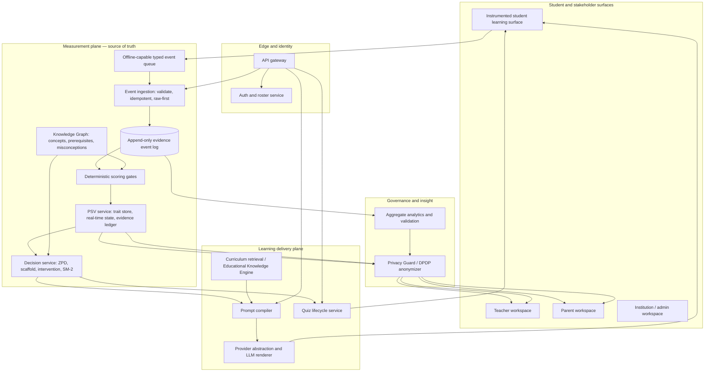

# Roognis AI — Architecture & Product Design Context

> **Purpose:** Give Claude Code the architectural scene, product vision, guardrails, and implementation sequence for Roognis AI.
>
> **Audience:** Engineers and Claude Code working on the Roognis repository.
>
> **Status:** Architecture direction and implementation guardrails. It is intentionally explicit about the difference between the MVP that exists and the measurement-first system being built.

---

## 1. Read This First

Roognis must be built as an **AI-native Academic Performance Operating System (APOS)** for Indian K–12 schools and NEET/JEE coaching centres, beginning with Tier 2/3 cities.

It is not:

- a generic chatbot;
- a Learning Management System (LMS) with an AI panel;
- a Retrieval-Augmented Generation (RAG) wrapper; or
- a content-delivery product that records a few engagement metrics.

Its durable asset is a **per-student, per-concept mastery timeline**, built from traceable evidence. Content, quizzes, tutoring, diagrams, and videos exist chiefly to produce learning evidence and support the next appropriate learning action.

The product moat is therefore not the chat experience. It is the longitudinal, evidence-backed model of what each student can do, does not yet understand, and is ready to learn next.

### Source-of-truth order

When working in the repository, resolve conflicts in this order:

1. **The actual code and database migrations** — current behaviour wins over documents.
2. `MASTERCONTEXT.md` — binding product direction and build order.
3. This document — architectural orientation and design intent.
4. Service-level low-level designs (LLDs) and older planning documents.

Do not silently reconcile a contradiction. State the conflict, identify the source of truth, and propose the smallest safe next action.

---

## 2. The Product in One Sentence

**Roognis captures high-quality evidence of learning, updates a reconstructable learner state through deterministic rules, selects the next learning action deterministically, and uses AI only to render that action in a helpful, curriculum-grounded form.**

This can be expressed as:

```text
learning interaction
  → typed evidence event
  → deterministic measurement and learner-state update
  → deterministic next-best-action decision
  → curriculum retrieval + LLM rendering
  → new learning interaction
```

The system should get more useful with each interaction because it accumulates reliable evidence, not merely because it has a longer chat history.

---

## 3. What “AI-Native” Means at Roognis

An AI-native Roognis system has these properties:

1. **Learner state is the runtime aggregate root.** A session or quiz attempt is evidence about the learner; it is not the centre of the product.
2. **Every meaningful interaction is a typed measurement event.** Events are versioned, attributable, and include client-side monotonic timing.
3. **High-impact learning decisions are gated and versioned.** Any model-assisted proposal must be independently validated and deterministically ratified before it affects delivery or learner state.
4. **LLMs are constrained renderers/extractors.** They do not bypass validation or write learner state directly.
5. **All learner-state writes have evidence provenance.** Every state update is traceable to events, model version, and gate version.
6. **Curriculum structure is graph-first.** Concepts, prerequisites, misconceptions, sibling concepts, and taxonomy are explicit relationships, not ad-hoc text labels.
7. **The frontend is a scientific instrument.** It captures clean learning evidence without blocking the learner’s experience.
8. **The system operates feedback loops.** It updates within an item/session, after a quiz, and in scheduled review cycles.
9. **Engagement and measurement are physically separate channels.** Preference or satisfaction signals cannot improve a learner’s academic mastery estimate.
10. **Recommendations are explainable.** The system can show the evidence and rule behind a recommendation in concise, human-readable language.

### The crucial boundary

| The system may use an LLM for | The system must decide deterministically |
|---|---|
| Explaining a selected concept in Hindi or English | The next concept or item |
| Rendering a worked example in an approved scaffold mode | Difficulty and scaffold mode |
| Creating a safe, curriculum-grounded diagram | Mastery, ability, or misconception updates |
| Extracting structured candidate metadata for human/review gates | Review scheduling and intervention |
| Paraphrasing an evidence-backed recommendation | Whether a teacher/parent should be alerted |

If an LLM can change what, when, how, or how hard the system teaches, it is in the wrong part of the architecture.

---

## 4. Product Example: One Student, One Closed Learning Loop

**Asha**, Class 8, is learning fractions. She can add fractions with equal denominators but repeatedly chooses an answer that adds unlike denominators directly. She also reports low confidence after trying twice.

1. The quiz player emits `item_rendered`, `first_interaction`, `option_selected`, `answer_submitted`, and a sampled `confidence_reported` event. Durations use `performance.now()`, not server timestamps.
2. The backend persists the raw events first and validates their schema/idempotency.
3. Deterministic evidence rules recognise the chosen distractor as evidence for the known “unlike-denominator” misconception. A gate evaluates correctness, response latency, prior mastery, confidence, and hint use.
4. The learner-state service writes an evidence-backed update: concept mastery remains low, confidence calibration is weak, and the current session state indicates elevated effort. It does **not** infer a clinical or mental-health condition.
5. The decision service selects a worked example about equivalent fractions because Asha is below the configured mastery threshold, then chooses a follow-up completion problem within her Zone of Proximal Development (ZPD).
6. Only now does the prompt compiler retrieve approved curriculum material and instruct the LLM to render a short bilingual, visual explanation in the selected scaffold mode.
7. Asha’s next response produces new evidence. Successful retrieval and later spaced-review performance, not the LLM’s confidence, determine whether mastery improves.

The student experiences a calm tutor. Underneath, Roognis runs an auditable measurement-and-decision loop.

---

## 5. Target High-Level Architecture



### Plane boundaries

- **Measurement plane:** Owns facts about learning. It is append-only, deterministic, versioned, and evidence-backed.
- **Delivery plane:** Delivers curriculum and feedback. It consumes already-made decisions; it cannot mutate learner state directly.
- **Governance plane:** Allows stakeholders to see safe summaries and validates that the learner model has predictive value. It must not expose raw learner state.

---

## 6. Core Domain Model

### 6.1 Typed learning events

Every event carries a versioned envelope:

```text
schema_version
event_id                 # client-generated idempotency key
event_type
student_id
session_id
item_id?                 # when an interaction relates to a learning item
node_id?                 # Knowledge Graph concept/misconception node
client_ts_mono           # monotonic client milliseconds
client_ts_wall           # ISO-8601, ordering only
payload                  # validated per event type
```

Core event types include:

```text
item_rendered                 first_interaction
option_selected               answer_changed
answer_submitted              item_skipped
hint_requested                confidence_reported
focus_lost                    focus_gained
self_explanation_submitted   worked_example_step_viewed
review_item_completed
```

Rules:

- Use `performance.now()` for elapsed time. Server clocks and network latency are not measures of student response time.
- Store raw validated events before scoring or aggregation.
- Upload in batches from an IndexedDB-backed queue; events must survive offline use, refreshes, and crashes.
- Reject invalid schema versions and deduplicate by `event_id`.
- Extend event types; never repurpose a previously defined type.

### 6.2 Learner state: PSV

`PSV` is the **Psychographic State Vector** name used in the existing project. In implementation, it must remain academic, explainable, and privacy-safe.

It is split into two stores:

| Store | Contents | Write rule |
|---|---|---|
| **Core traits** | Per-concept mastery, calibration, persistent academic learning patterns | High evidence threshold, versioned, immutable history |
| **Real-time state** | Session effort, current friction, temporary engagement signal, active scaffold context | Session-scoped, decays to `null`, never exported raw |

Each write must record `event_ids[]`, `gate_version`, `model_version`, timestamp, and the relevant concept/node. A student state must be reconstructable from the event log plus versioned rules.

Do not use clinical fields, diagnoses, or mental-health labels. Roognis models academic learning signals only.

### 6.3 Knowledge Graph

The Knowledge Graph (KG) represents the learning domain rather than relying on free-text “weak area” labels.

Minimum node/edge model:

```text
Concept node
  ├─ prerequisite → Concept
  ├─ sibling → Concept                 # supports interleaving
  ├─ misconception → Misconception
  ├─ taxonomy → subject/chapter/grade/board
  └─ distractor → ItemOption
```

Every assessment item must identify the concept it measures. Diagnostic distractors must be linked to misconception nodes where possible. An LLM can propose labels or item drafts, but the graph relationship must be validated and controlled before use in measurement.

### 6.4 Evidence-Centred Design

Each PSV field must have an explicit evidence model before code is added:

```text
construct model  → what academic property is being measured?
evidence model   → which typed events support/refute it and at what weight?
task model       → which interaction can elicit that evidence reliably?
validation KPI   → how will we test that it predicts meaningful future performance?
```

No new learner attribute is allowed without all four definitions.

---

## 7. Deterministic Decision Layer

The decision service is the product’s control plane. It should consist of pure, tested functions with stable input/output contracts.

### Inputs

- current PSV snapshot;
- KG context: concepts, prerequisites, misconceptions, and item metadata;
- assessment/evidence history;
- explicit course, teacher-assignment, and safety constraints;
- time/review schedule state.

### Decisions

| Decision | Initial deterministic policy |
|---|---|
| Next item | Select an eligible item with predicted probability of correctness in the target ZPD band, initially `0.60–0.75` |
| Scaffold mode | Mastery `< 0.30`: worked example; `0.30–0.70`: completion problem; `≥ 0.70`: bare problem |
| Review schedule | SM-2 spaced-repetition policy, adapted only through versioned deterministic rules |
| Mastery update | Evidence-weighted model such as EWM/Bayesian Knowledge Tracing; use latency, correctness, hints, and calibrated confidence only through explicit gates |
| Intervention | Rules for wheel-spinning, overconfidence, repeated prerequisite failure, or disengagement; route to an educator where required |
| Teacher insight | Aggregate, privacy-filtered class patterns; never raw student PSV |

The first implementation can be deliberately simple, but it must be deterministic, versioned, explainable, and tested. Sophisticated models are not a substitute for clean evidence.

### Explainability contract

Every decision response must be able to produce a short explanation such as:

> “A worked example was selected because the last two attempts on prerequisite concept `equivalent_fractions` were incorrect, with a hint requested. Decision policy: `scaffold-v1.2`.”

This explanation is generated from the decision record. An LLM may phrase it, but cannot invent the decision rationale.

---

## 8. LLM, RAG, and Content Architecture

### Correct flow

```text
PSV snapshot + deterministic decision + approved curriculum context
  → prompt compiler
  → provider abstraction
  → LLM renderer
  → safety validation
  → student-facing response
```

### Rules

- RAG is a **subroutine of the prompt compiler**, invoked after a teaching decision. It is not the system’s routing engine.
- Retrieve only institution-approved and curriculum-scoped content.
- The prompt compiler produces structured prompts from explicit components: role/safety rules, selected decision, scaffold mode, learner language/preference block, and cited curriculum context.
- The LLM has no direct database credentials or learner-state write path.
- AI outputs must pass structural and child-safety validation before reaching a student or a persistence layer.
- Free text generated by an LLM must never become a psychometric label or a mastery update.

### Current-to-target prompt evolution

The existing MVP’s tutor path composes profile text, RAG chunks, chat history, and a student question. Keep the safety and provider abstractions, but evolve the prompt path only after the measurement and decision layers are frozen:

```text
MVP string prompt → versioned prompt compiler
                 → decision-bound retrieval
                 → structured render instruction
                 → validated learning response
```

---

## 9. Current Implementation: Preserve, Don’t Pretend It Is the Target

The repository currently contains a useful **AI-featured tutor MVP**, not yet the target APOS. Treat this honestly.

### Existing, valuable components

| Component | Present responsibility | Direction |
|---|---|---|
| `services/auth` | Identity, roles, parent links | Keep; extend only for roster/grade needs |
| `services/lms` | Classroom, coursework, gradebook, guardian and rubric CRUD | Keep; do not make it the measurement engine |
| `services/ai` | Tutor chat, safety, provider abstraction, image jobs, feedback | Keep safety; evolve prompt use later |
| `services/rag` | Ingestion, chunks, educational entity extraction, retrieval | Keep; demote to prompt-compiler subroutine |
| `services/quiz` | Quiz lifecycle and current scoring path | Rework scoring around measurement contracts |
| `services/analytics` | Coarse product events and dashboards | Redesign around typed per-item evidence and safe aggregates |
| `web/` | React/Vite application | Rebuild student flow as the measurement instrument |
| `frontend/index.html` | Legacy static client | Keep or retire only after the primary frontend is explicitly selected |

### Existing technical reality

| Area | Actual state now | Target direction |
|---|---|---|
| Services | Mixed Node.js/Express/Prisma and FastAPI/SQLAlchemy | Keep existing stacks when editing existing services; use the target stack for new services |
| Frontend | React/Vite exists; older static frontend also exists | Next.js 15 / React 19 / TypeScript strict is target; do not migrate incidentally |
| Relational data | PostgreSQL, isolated schemas | PostgreSQL, schema-per-service |
| Vector retrieval | Chroma with Ollama embeddings/test mode | Qdrant + FastEmbed/BGE is an explicit later migration decision |
| LLM default | Gemini with Groq/Ollama alternates | Provider abstraction; Groq target default is an explicit migration decision |
| Deployment | Docker Compose; Kubernetes manifests also exist | OCI Compute + Docker Compose first; no Kubernetes work without a concrete scaling trigger |

### Missing target capabilities

- typed, per-item evidence stream;
- client-side monotonic timing and offline event queue;
- event ingestion that is schema-validated, idempotent, and raw-first;
- evidence ledger and trait/state PSV stores;
- KG with prerequisite and misconception relationships;
- deterministic mastery gates, ZPD selection, scaffold selection, intervention policy, and SM-2 scheduling;
- DPDP Privacy Guard before parent/teacher read views;
- validation dashboards proving the learner model improves future-performance prediction.

Never claim these capabilities are complete until their contracts, code, tests, and integration have been verified.

---

## 10. Service Boundaries

### Existing-service ownership

| Service | Owns | Must not own |
|---|---|---|
| Auth | identity, roles, school membership, parent links | learner measurement, learning decisions, or classroom workflow |
| LMS | classroom/coursework workflow and gradebook operations | psychometric state |
| Quiz | authoring/review, assignment, attempt lifecycle, authoritative answer records | autonomous learner modelling or LLM decision-making |
| AI | provider calls, child safety, rendering, diagrams, candidate structured extraction | selecting next content or writing PSV |
| RAG/EKE | source ingestion, entities, chunks, curriculum retrieval | routing or learner-state decisions |
| Analytics | aggregate operational and validation views | quiz source of truth, raw PSV exposure |

### New services required by the target architecture

| Service | Responsibility | Target technology direction |
|---|---|---|
| `services/kg` | Curriculum Concept DAG and misconception/item links | FastAPI, Neo4j |
| `services/psv` | Trait store, real-time state store, evidence ledger | FastAPI, PostgreSQL/Neo4j as warranted |
| `services/decisions` | Pure deterministic selection, scaffolding, intervention, scheduling | FastAPI; logic independently unit-tested |
| `services/privacy` | DPDP anonymization and policy guard for stakeholder views | FastAPI; mandatory gateway for teacher/parent PSV-derived data |

Do not introduce Kafka, an event bus, Kubernetes, or separate OLAP infrastructure without a demonstrated operational need. The event model must be correct before the infrastructure is made more complex.

---

## 11. Strict Build Sequence

Do not skip layers. A later layer built against an unstable earlier contract creates architecture debt that invalidates measurement quality.

### Layer 0 — Freeze contracts

1. Versioned learning-event schema and per-event payloads.
2. PSV trait/state schema, including evidence thresholds and decay policies.
3. KG schema for concepts, prerequisites, misconceptions, siblings, and taxonomy.
4. Evidence-Centred Design mappings and validation KPIs.

**Exit condition:** reviewed, versioned contracts with examples and contract tests.

### Layer 1 — Build the measurement instrument

1. Instrumented quiz player in the React application.
2. `performance.now()` timing and typed event emission.
3. IndexedDB queue, batched uploads, idempotency, offline/crash tolerance.
4. Server ingestion: validate, reconcile timestamps, persist raw events first.

**Exit condition:** clean, real, per-item evidence streams can be observed end-to-end.

### Layer 2 — Build learner state

1. KG service and concept graph.
2. PSV traits, transient state, evidence ledger.
3. Pure deterministic gates for initial mastery, calibration, and disengagement signals.
4. Unit and integration coverage for every mutation path.

**Exit condition:** every learner-state update is reconstructable and evidenced.

### Layer 3 — Build decision logic

1. ZPD item selection.
2. Scaffold-mode policy.
3. SM-2 review scheduler.
4. Intervention rules and teacher escalation.

**Exit condition:** selected actions are deterministic, explainable, and can be replayed from a PSV snapshot.

### Layer 4 — Improve delivery with AI

1. Build the decision-bound prompt compiler.
2. Demote RAG to a retrieval subroutine.
3. Render policy-selected explanations through the provider abstraction.
4. Keep child-safety and output validation at the boundary.

**Exit condition:** LLMs enhance delivery without controlling learning policy or PSV writes.

### Layer 5 — Safely expose stakeholder insight

1. Implement `services/privacy`.
2. Teacher class mastery heatmaps and intervention queue using aggregates.
3. Parent longitudinal academic progress and summary views.

**Exit condition:** no teacher or parent pathway can access raw PSV or ephemeral affect state.

### Layer 6 — Validate the thesis

1. Compare next-performance prediction with and without PSV features.
2. Track AUC (Area Under Curve), calibration error, test–retest reliability, and intervention lift.
3. Rework any PSV dimension that does not improve predictive validity.

**Exit condition:** Roognis has evidence that its learner model is useful rather than decorative.

---

## 12. Privacy, Safety, and Child Protection

All learners are presumed minors. Design for India’s Digital Personal Data Protection Act, 2023 (DPDP Act) from the start.

- Measure academic constructs only: concept mastery, calibrated confidence, persistence, and learning effort.
- Do not diagnose, infer, store, or label mental-health conditions, attention disorders, anxiety, depression, or other clinical constructs.
- Any possible welfare concern becomes a human-review flag, never an automated diagnosis or an automated parent notification.
- Ephemeral affect/friction signals decay to `null`; they are not exported to third parties or shown raw to parents.
- Teacher and parent views must go through the Privacy Guard and receive only role-appropriate aggregates/statuses.
- The evidence ledger is also the audit trail: why was data used, what evidence caused the update, and which version of the rules applied?
- Existing AI input/output/image safety controls remain mandatory at all model boundaries.

---

## 13. Engineering Rules for Claude Code

Before any non-trivial change:

1. Read the actual relevant files, tests, migrations, and current service interfaces.
2. State the applicable architecture layer.
3. Separate confirmed facts, assumptions, and unknowns.
4. Freeze or validate contracts before implementation.
5. Make the smallest cohesive change, including tests, input validation, structured logging, and error handling.
6. Report any drift or debt discovered, without silently redesigning unrelated code.

### Non-negotiables

- No LLM calls in scoring, item selection, routing, difficulty selection, intervention, or PSV mutation paths.
- No server-side timestamps as student response-latency measures.
- No profile/PSV write without evidence IDs, model version, and gate version.
- No state observation directly mutating durable traits without the declared evidence threshold.
- No untyped event blob as a substitute for the event contract.
- No `localStorage` or `sessionStorage` for event-pipeline data; use the typed offline queue.
- No parent/teacher PSV-derived view before the Privacy Guard exists.
- No accidental stack migrations while implementing a feature.
- Do not present placeholders or untested measurement logic as complete.

---

## 14. Completion Definition

Roognis is succeeding when it can reliably answer, with evidence:

1. What concept is this student ready to work on next?
2. What evidence supports that choice?
3. What misconception or prerequisite is blocking progress?
4. Which scaffold is appropriate now?
5. Did the selected action improve later performance?
6. What should a teacher do that is meaningfully human and high-leverage?

The visual tutor, RAG, diagrams, and dashboards matter — but they are delivery and experience layers around that core learning-intelligence loop.

---

## 15. One-Line Operating Principle

**The frontend captures trustworthy evidence; deterministic services convert it into an explainable learner state and next action; AI renders that action safely and beautifully; the system proves it improves learning.**
